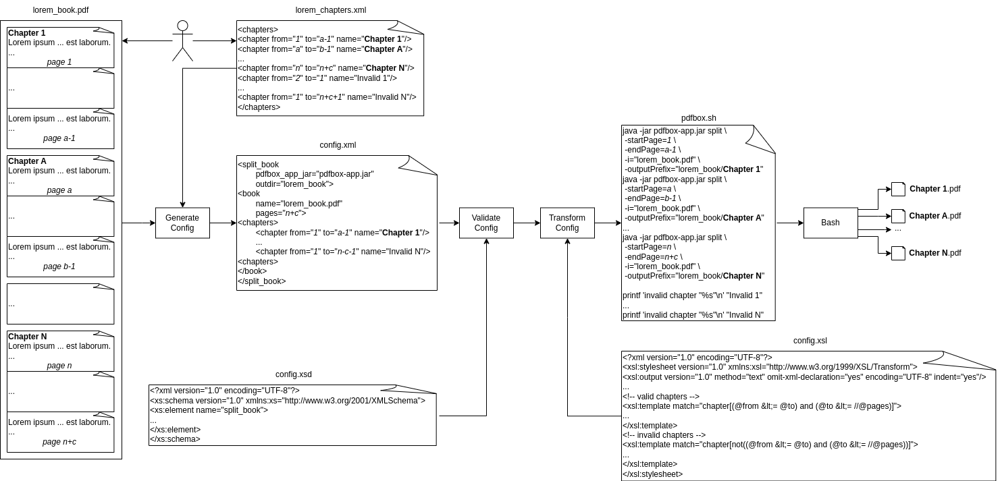

# split_book

## A Bash script to split a PDF book into chapters based on a CSV file. 

## Index

* [Motivation](#motivation)
* [Overview](#overview)
* [Example](#example)
* [Chapter Ranges CSV](#chapter-ranges-csv)
* [Flowchart](#flowchart)
* [Exit Codes](#exit-codes)
* [Dependencies](#dependencies)
* [License](#license)

## Motivation

Splitting a book (PDF file) into chapters can be time-consuming if the book is large (e.g., 100 MB) and internet speeds are slow. This script allows you to split a PDF book into chapters offline, saving time and bandwidth.

## Overview

|Name|Description|
|---|---|
|doc/|Contains a flowchart diagram and an example (see [_Example_](#example) section)|
|LICENSE|The GNU General Public License Version 3|
|README\.md|This file|
|split_book\.sh|Entry point script|
|test/|Contains a script to test all exit codes (see [_Exit Codes_](#exit-codes) section)|

## Example

```console
user@debian:~/Documents/programs/split_book$ uname -snrmo
Linux debian 6.1.0-28-amd64 x86_64 GNU/Linux
user@debian:~/Documents/programs/split_book$ ls
doc  LICENSE  README.md  split_book.sh  test
user@debian:~/Documents/programs/split_book$ cd doc/
user@debian:~/Documents/programs/split_book/doc$ ls
example  flowchart
user@debian:~/Documents/programs/split_book/doc$ cd example/
user@debian:~/Documents/programs/split_book/doc/example$ ls
book.ms  book.pdf  chapters.csv
user@debian:~/Documents/programs/split_book/doc/example$ cat chapters.csv 
1,2,Chapter 1
3,8,Chapter 2
9,16,Chapter 3
user@debian:~/Documents/programs/split_book/doc/example$ bash ../../split_book.sh book.pdf chapters.csv 
user@debian:~/Documents/programs/split_book/doc/example$ ls
book  book.ms  book.pdf  chapters.csv
user@debian:~/Documents/programs/split_book/doc/example$ ls book
'Chapter 1.pdf'  'Chapter 2.pdf'  'Chapter 3.pdf'
```

__NOTE:__ You can set the execution permission using `chmod u+x split_book.sh` and update the PATH with `export PATH=$PATH:<SCRIPT_PATH>`.

## Chapter Ranges CSV

The CSV file containing the chapter ranges has the columns `FROM,TO,NAME` where:
- The first column is a positive integer representing the starting page number.
- The second column is a positive integer representing the ending page number.
- The third column is a non-empty string representing the chapter name.

__NOTE:__ If a row matches the criteria and has more than three columns, the remaining columns are considered as part of the chapter name.

## Flowchart

The pipeline of the script can be shown with the next flowchart:



## Exit Codes

|Code|Meaning|
|---|---|
|0|Everything was successful|
|11|Script was not launched with two parameters|
|13|Book PDF or chapter ranges CSV files was not found|
|17|Book PDF file was not a valid PDF file|

## Dependencies

This project uses a number of commands to work properly:

|Name|Description|Version|Installation|
|---|---|---|---|
|pdfinfo|Portable Document Format (PDF) document information extractor|22.12.0-2|`apt install poppler-utils`
|pdftk|A handy tool for manipulating PDF|2.02-5|`apt install pdftk`
|awk|Pattern scanning and text processing language|1.3.4.20200120-3.1|`apt install mawk`
|printf|Format and print data |9.1-1|`apt install coreutils`
|mkdir|make directories|9.1-1|`apt install coreutils`

## License

This project is licensed under the GNU General Public License v3.0 - see the LICENSE file for details.

## EOR (End Of Repository)

### I hope this program is useful to you. Thank you very much for visiting this repository!
### Espero que este programa te sea útil. ¡Muchas gracias por visitar este repositorio!
### Espero que este programa séache de utilidade. Moitas grazas por visitar este repositorio!
