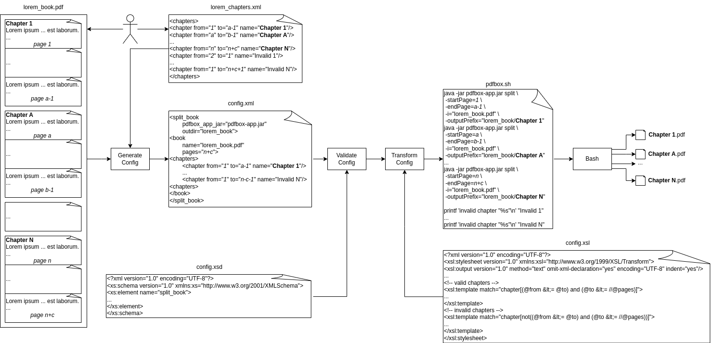

# split_book

## _a GNU/Linux shell program to split a book into chapters_

## Index

* [Motivation](#motivation)
* [Overview](#overview)
* [Chapters Tags](#chapters-tags)
* [XSD and XSL](#xsd-and-xsl)
* [Example](#example)
* [Exit Codes](#exit-codes)
* [Dependencies](#dependencies)
* [License](#license)

## Motivation

Sometimes I want to split a book (PDF file) into chapters (another PDF files), but if it is _large_ (100 MB for example) and the internet up/download speed is slow, splitting it online (iLovePDF for example) can be time-consuming. So I developed this program to split a book into chapters offline. Graphically:



## Overview

|Name|Description|
|---|---|
|config\.sh|it contains program constants|
|doc/|it contains a diagram and an example (see [_Example_](#example) section)|
|gpl-3.0.txt|it is the GNU General Public License Version 3|
|README\.md|it is this file|
|split_book\.sh|it contains _main()_ function|
|test/|it containts a script to test all exit codes (see [_Exit Codes_](#exit-codes) section)|
|xml/|it containts the xsd and xsl files (see [_XSD_and_XSL_](#xsd-and-xsl) section)|

## Example

```shell
user@debian:~/Documents/programs/split_book$ uname -snrmo
Linux debian 6.1.0-28-amd64 x86_64 GNU/Linux
user@debian:~/Documents/programs/split_book$ ls
config.sh  doc  gpl-3.0.txt  README.md  split_book.sh  test  xml
user@debian:~/Documents/programs/split_book$ cd doc/
user@debian:~/Documents/programs/split_book/doc$ ls
diagram  example
user@debian:~/Documents/programs/split_book/doc$ cd example/
user@debian:~/Documents/programs/split_book/doc/example$ ls
lorem_book.ms  lorem_book.pdf  lorem_chapters.xml
user@debian:~/Documents/programs/split_book/doc/example$ cat lorem_chapters.xml 
<chapter from="1" to="2" name="Chapter 1"/>
<chapter from="3" to="8" name="Chapter 2"/>
<chapter from="9" to="16" name="Chapter 3"/>
user@debian:~/Documents/programs/split_book/doc/example$ bash ../../split_book.sh lorem_book.pdf lorem_chapters.xml 
user@debian:~/Documents/programs/split_book/doc/example$ ls
lorem_book  lorem_book.ms  lorem_book.pdf  lorem_chapters.xml
user@debian:~/Documents/programs/split_book/doc/example$ ls lorem_book
'Chapter 1.pdf'  'Chapter 2.pdf'  'Chapter 3.pdf'
```

__NOTE:__ you can set the bit execution permission ```chmod u+x split_book.sh``` and update the \$PATH ```export PATH=$PATH:<SCRIPT_PATH>```

## Chapter Tags

The book chapters to split are indicated in a xml. This xml is valid iff:
1. there is no XML declaration ```<?xml version="1.0" encoding="utf-8"?>```
2. _\<chapter>_ tag appears at least once
3. _\<chapter>_ tag has 3 non-optional attributes: _from_, _to_ and _name_
4. _from_ attribute is a positive integer (it indicates the first book page to split)
5. _to_ attribute is a positive integer, (it indicates the last book page to split)
6. _name_ attribute is a non-empty string, (it indicates the new PDF name to generate)

Some invalid ```<chapter>``` tags (see _test/_ directory):
```xml
<shapter from="1" to="1" name="name"/> 	<!-- misspelled tag chatper -->
<chapter fom="1" to="1" name="name"/> 	<!-- misspelled attribute from -->
<chapter from="1" t="1" name="name"/> 	<!-- misspelled attribute to -->
<chapter from="1" to="1" nme="name"/> 	<!-- misspelled attribute name -->
<chapter to="1" name="name"/>		<!-- missing attribute from -->
<chapter from="1" name="name"/>		<!-- missing attribute to -->
<chapter from="1" to="1"/>		<!-- missing attribute name -->
<chapter from="0" to="1" name="name"/>	<!-- attribute from is not a positive integer -->
<chapter from="1" to="0" name="name"/>	<!-- attribute to is not a positive integer -->
<chapter from="1" to="1" name=""/>	<!-- attribute name is an empty string-->
```

## XSD and XSL

During the execution, a temporary xml is created. It contains information about the book to split and the chapter tags. 
This temporary script has the next format (see _config/config.xsd_ file for more info):

```
<book pages="PAGES">
<chapters>
<chapter from="FROM" to="TO" name="NAME"/> <!-- minOccurs="1" -->
</chapters>
</book>
```

Where:
1. _PAGES_ is book PDF file total pages 
2. _FROM_ is the page where the chapter of the book starts.
3. _TO_ is the page where the chapter of the book ends.
4. _NAME_ is the chapter name

For each _\<chapter>_ tag such as _FROM_ <= _TO_ <= _PAGES_, the next command is generated: 

```
printf 'generating "%s.pdf" ... ' "NAME"
java -jar "PDFBOX_APP_JAR" split \
 -startPage=FROM \
 -endPage=TO \
 -i="BOOK" \
 -outPrefix="OUTDIR/NAME"
mv "OUTDIR/NAME-1.pdf" "OUTDIR/NAME.pdf"
printf 'done!\n'
```

__NOTE:__ PDFBox by default appends the string "_-1.pdf_" to _-outputPrefix_ value.

For each _\<chapter>_ tag such as not(_FROM_ <= _TO_ <= _PAGES_), the next command is generated: 

```
printf 'invalid chapter "%s", because from=%i is greater than to=%i or to=%i is greater than pages=%i\n' \
 "NAME" "FROM" "TO" "TO" "PAGES"
```
## Exit Codes

|Code|Meaning|
|---|---|
|0|everything was coming up Milhouse|
|11|program was not launched with two arguments|
|13|book PDF file was not found|
|17|chapters XML file was not found|
|19|book PDF files was not a valid PDF file|
|23|generated config xml was not valid|

## Dependencies

This project uses a number of commands to work properly:

|Name|Description|Version|License|Installation|
|---|---|---|---|---|
|xmllint|command line XML tool|2.9.14+dfsg-1.3~deb12u1|MIT License|```apt install libxml2-utils```|
|xsltproc|command line XSLT processor|1.1.35-1|MIT License|```apt install xsltproc```|
|pdfinfo|Portable Document Format (PDF) document information extractor|22.12.0-2+b1|MIT License|```apt install poppler-utils```|
|grep|print lines that match patterns|3.8-5|GPLv3+|```apt install grep```|
|dirname|strip non-directory suffix from file name|9.1-1|GPLv3+|```apt install coreutils```|
|basename|strip directory and suffix from filenames|9.1-1|GPLv3+|```apt install coreutils```|
|realpath|print the resolved path|9.1-1|GPLv3+|```apt install coreutils```|
|printf|format and print data |9.1-1|GPLv3+|```apt install coreutils```|
|mkdir|make directories|9.1-1|GPLv3+|```apt install coreutils```|
|cut|remove sections from each line of files|9.1-1|GPLv3+|```apt install coreutils```|

## License

GPLv3 (see _gpl-3.0.txt_ file).

## EOR (End Of Repository)

### I hope this program is useful to you, thanks you very much for visiting this repository!
### Espero que este programa te sea útil, muchas gracias por visitar este repositorio!
### Espero que este programa séache de utilidade, moitas grazas por visitar este repositorio!
